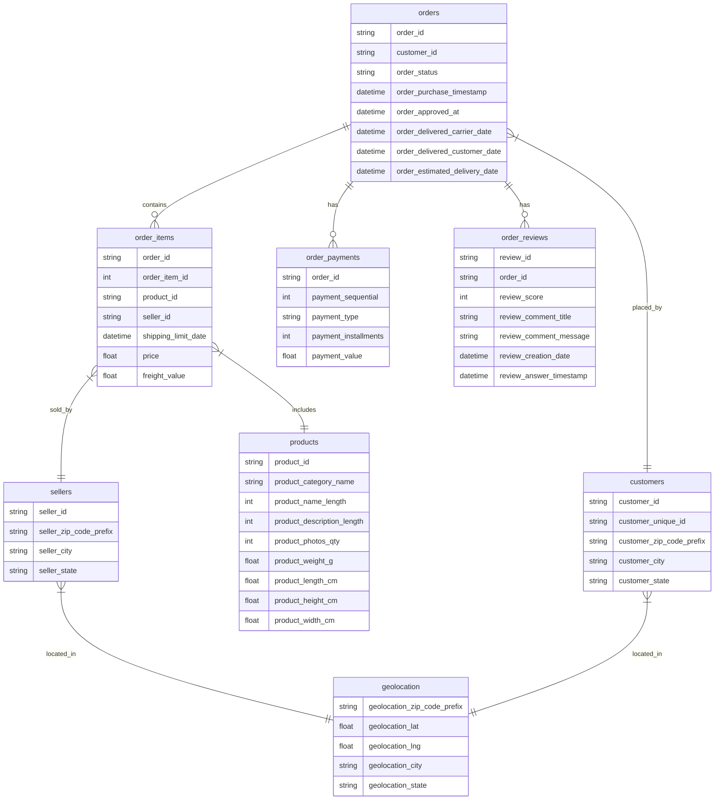
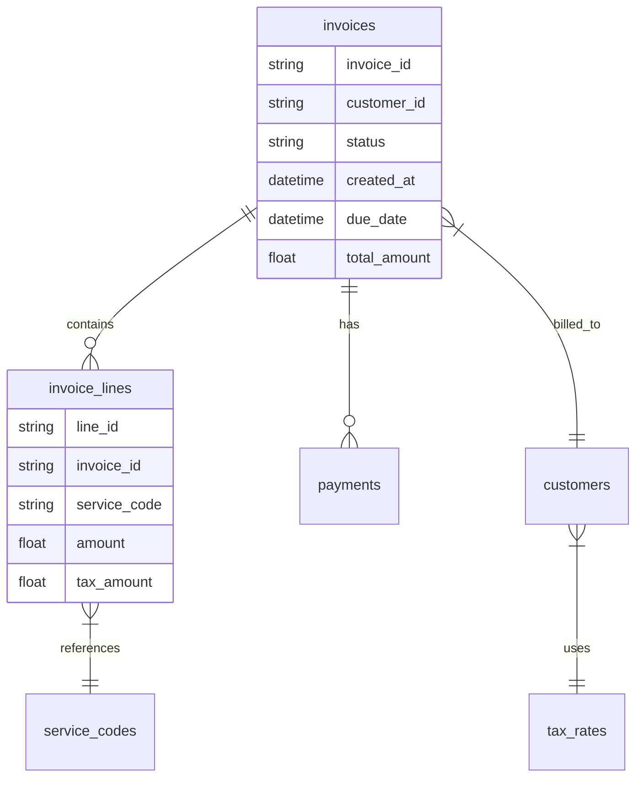

# ❤️ LLM LAB Entry Assignment

## Building a Simple LLM-to-SQL Pipeline

### Objective:
Create a script that demonstrates your ability to integrate LLMs with databases by building a simple, yet robust, prompt-to-query pipeline.

### Database:
[SQLite database](https://www.kaggle.com/datasets/terencicp/e-commerce-dataset-by-olist-as-an-sqlite-database/data) provided on ❤️ Valentine's Day (Feb 14, 2025)

### Resources:
You may use:
- Any LLM and coding language you prefer
- [OpenAI GPT-4](https://platform.openai.com/docs/overview) (recommended; free $18 credit available)
- [Google AI Studio](https://aistudio.google.com/welcome) (free $20 credit available with personal Google account)
- [Anthropic Claude](https://docs.anthropic.com/en/docs/initial-setup) (free $8 monthly credit)

> [!TIP]
> For any unclear details, feed this assignment into ChatGPT or Claude. They’ll gladly explain everything in detail!

> [!NOTE]
> All data used in this assignment comes from open sources and can be shared freely.

### Technical Requirements:
- Keep it simple.
    - Python code can fit into one file (excluding prompts and tests)
    - Other languages: reasonable length accepted
- Must include unit tests
- Must handle basic errors
- Must use clear logging
- Choose any language executable locally (Typescript, Python, Go, Java, etc.)

### Core Questions to Answer (to be extended):
- What is the accuracy of LLM-generated SQL queries versus human-written queries?
- Which question types yield highest/lowest accuracy? Provide examples.
- How would you implement safety checks for harmful SQL queries?
- What metrics would you use to evaluate SQL query quality?
- How would you handle edge cases like:
    - Infinite recursion during query generation
    - Malicious attempts to alter database structure
    - Ambiguous natural language questions

### Bonus Questions (optional):
- How to implement query caching to boost performance?
- Which prompt engineering techniques enhance SQL accuracy?
- How would you implement feedback loops for query improvement?

### Evaluation Criteria:
- Code quality and clarity
- Test coverage
- Error handling
- Documentation
- Depth of analysis

### Submission Requirements:
- All code must run during a 15-minute review
- Questions implemented as runnable test cases
- Clear organization for rapid demonstration
- Any language supported by IDE is accepted
- Provide setup instructions for non-standard dependencies

🗓️ **Deadline:** Sunday, February 23rd, 2025

📋 **Review Process:**
- Scheduled 15-minute code review
- Prepare to run and discuss your code
- Ensure development environment readiness

## Detailed Questions
Generate accurate SQL queries addressing these questions:

1. Which seller has delivered the most orders to customers in Rio de Janeiro? [string: seller_id]
2. What's the average review score for products in the 'beleza_saude' category? [float: score]
3. How many sellers have completed orders worth more than 100,000 BRL in total? [integer: count]
4. Which product category has the highest rate of 5-star reviews? [string: category_name]
5. What's the most common payment installment count for orders over 1000 BRL? [integer: installments]
6. Which city has the highest average freight value per order? [string: city_name]
7. What's the most expensive product category based on average price? [string: category_name]
8. Which product category has the shortest average delivery time? [string: category_name]
9. How many orders have items from multiple sellers? [integer: count]
10. What percentage of orders are delivered before the estimated delivery date? [float: percentage]

Implementation must:
- Generate accurate SQL queries
- Respect data relationships
- Provide results in specified formats
- Include robust error handling
- Contain comprehensive unit tests (for each question)

## Dataset and Schema
We use the open dataset [Olist E-commerce SQLite](https://www.kaggle.com/datasets/terencicp/e-commerce-dataset-by-olist-as-an-sqlite-database/data).



## 💡 Pro Tip: Writing Effective LLM Prompts

> [!TIP]
> Modern LLMs perform exceptionally with structured markdown! Feed structured markdown prompts to LLMs to clearly define context and format (simply copy the content below).

````markdown
You are an expert in SQLite, Python and data analysis.
You work at Maersk's Invoice Processing Department analyzing global shipping invoices.
Given a user request, respond with a python code to carry out the task.

User already has a running Jupyter notebook with an available SQLite database. The first cell of the notebook has some helper routines to interact with it:

```python
import pandas as pd
import numpy as np
import sqlite3

def query(q: str):
    with sqlite3.connect('maersk_invoices.db') as conn:
        df = pd.read_sql_query(q, conn)
        for col in df.columns:
            if "Date" in col or "Timestamp" in col:
                df[col] = pd.to_datetime(df[col], errors='coerce')
    return df
```

Tables in this SQLite database:
- invoices (500k rows): Main invoice records, includes status and dates
- invoice_lines (2M rows): Individual line items with amounts in USD cents
- customers (50k rows): Customer details with VAT numbers and addresses
- service_codes (100 rows): Service definitions and categories 
- payments (800k rows): Payment records linked to invoices
- tax_rates (200 rows): VAT and tax rules by country

// Some [Exploratory Data Analysis](https://en.wikipedia.org/wiki/Exploratory_data_analysis) can be added as well to improve quality of queries

A few important conventions:
1. All monetary values are in USD cents
2. All dates are in UTC timezone
3. Service codes follow Maersk's 4-letter format (e.g., 'FREU' for freight)
4. Customer IDs use the SAP format
5. For tables - return DataFrame, for reports - return markdown

Database schema is attached below. Note the relationships between invoices, customers and services.


````


✨ Why markdown format works great with LLMs:
1. 🎯 Clear structure that LLMs can parse easily
2. 📚 Code blocks are properly formatted
3. 🗃️ Lists and tables are well-organized
4. 🔑 Headers provide clear hierarchy
5. 📊 Support for diagrams and charts

## Recommended Workflow:

- **Define Clear Prompts:**
  Use structured prompts clearly specifying the expected result type, ensuring that the generated SQL adheres strictly to the provided schema.

- **Initial Exploration:**
  Generate queries manually for the listed questions. Validate and test them thoroughly.

- **Compare Queries:**
  Generate corresponding queries with your chosen LLM. Compare accuracy and efficiency against human-generated queries.

- **Unit Tests:**
  Create unit tests for each question:
    - Assert correct format (integer, float, string)
    - Assert the output matches manually checked results (or ground truth)
    - Refine the prompt to ensure stable results

- **Logging:**
  Implement clear logging (query, execution status, result snippet) to simplify debugging and evaluation.

> [!NOTE]  
> Start with a basic implementation, gradually add complexity, and clearly document your decisions and trade-offs. Evaluation accuracy are more important than complexity in this assignment.

Enjoy building your first LLM-to-SQL pipeline! 🚀

--- 
❤️ **LLM LAB – 2025**